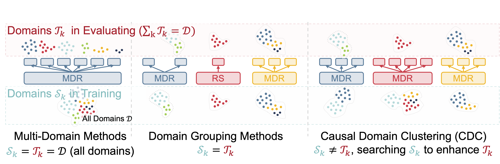
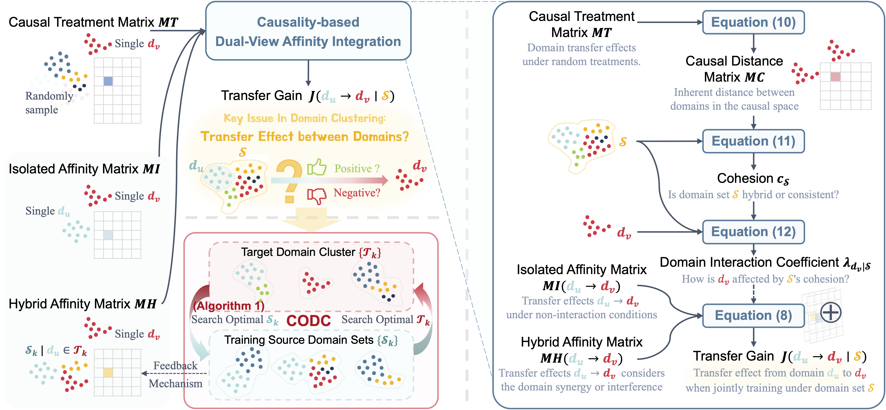
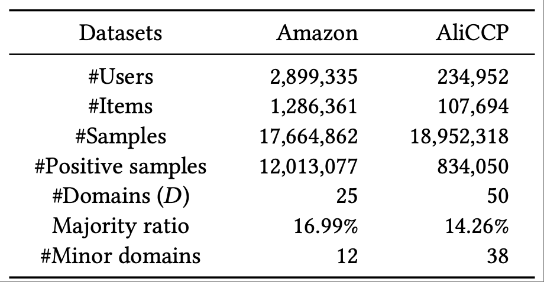

# Causal-Domain-Clustering-for-Multi-Domain-Recommendation

This repository contains the **official code** for the paper *CDC: Causal Domain Clustering for Multi-Domain Recommendation*, which has been accepted to *SIGIR 2025*.

* [Official Paper Link](https://dl.acm.org/doi/10.1145/3726302.3729919)

* [ArXiv Link](https://arxiv.org/abs/2507.06877)

If you find this repository or our paper helpful for your research, please consider citing:

```bibtex
@inproceedings{10.1145/3726302.3729919,
author = {Luo, Huishi and Wu, Yiqing and Chen, Yiwen and Zhuang, Fuzhen and Wang, Deqing},
title = {CDC: Causal Domain Clustering for Multi-Domain Recommendation},
year = {2025},
isbn = {9798400715921},
publisher = {Association for Computing Machinery},
address = {New York, NY, USA},
url = {https://doi.org/10.1145/3726302.3729919},
doi = {10.1145/3726302.3729919},
booktitle = {Proceedings of the 48th International ACM SIGIR Conference on Research and Development in Information Retrieval},
pages = {1840–1849},
numpages = {10},
location = {Padua, Italy},
series = {SIGIR '25}
}
```

## Tables of Contents

  * [:mag: Overview](#-mag--overview)
  * [:bricks: Structure](#-bricks--structure)
  * [:package: Requirements](#-package--requirements)
  * [:bar_chart: Datasets](#-bar_chart--datasets)
    * [Amazon Dataset](#amazon-dataset)
    * [AliCCP Dataset](#aliccp-dataset)
  * [:test_tube: Run](#-test_tube--run)
  * [:page_facing_up: License](#-page_facing_up--license)
  * [:pushpin: Related Repositories](#-pushpin--related-repositories)
  * [:email: Contact](#-email--contact)


---

## :mag: Overview

Traditional Multi-Domain Recommendation (MDR) models struggle to scale to industrial settings involving dozens or hundreds of domains due to excessive parameter costs and negative transfer across unrelated domains.

The domain grouping technique treats multiple domains within the same cluster as a single domain, thereby significantly reducing training resource overhead. However, existing domain grouping methods, based on business logic or data similarities, often fail to capture the true transfer relationships required for optimal grouping.    

<div align="center">
      
      <p><strong><figcaption>Figure 1:</strong>Compared with existing MDR and domain grouping methods, CDC optimizes training source domain sets to maximize target cluster performance.</p>
</div>


To effectively cluster domains, we propose Causal Domain Clustering (CDC). CDC integrates:
- **Isolated & Hybrid Domain Affinity Matrices** to model domain-wise transfer effect from two perspectives: isolated (independent) and hybrid (interactive).
- **Causal Discovery** to fuse multiple transfer views adaptively.
- **Co-Optimized Dynamic Clustering (CODC)** to iteratively optimize  target domain clustering and source domain selection for training.

<div align="center">
      
      <p><strong><figcaption>Figure 2:</strong> Causal Domain Clustering (CDC) framework.</p>
</div>

CDC significantly enhances performance across over 50 domains on public datasets and in industrial settings, achieving a 4.9% increase in online eCPM across 64 domains.


## :bricks: Structure

```bash
.
├── main.py                 # Entry point for argument parsing and config loading
├── run.py                  # Main script for end-to-end training and evaluation
├── config.py               # Model and training configuration settings
├── preprocess.py           # Called in main.py; loads cached processed data if available, otherwise runs preprocessing and exports processed files
├── model/                  # CDC and baseline models
│   ├── cdc.py              # Our proposed CDC model
│   ├── adasparse.py        # Baseline: AdaSparse
│   ├── star.py             # Baseline: STAR
│   ├── ple.py              # Baseline: PLE
│   ├── mmoe.py             # Baseline: MMoE
│   ├── pepnet.py           # Baseline: PEPNet
│   ├── hinet.py            # Baseline: HiNet
│   ├── autoint.py          # Baseline: AutoInt
│   ├── dcn.py              # Baseline: DCN
│   ├── dcnv2.py            # Baseline: DCNv2
│   ├── dfm.py              # Baseline: DeepFM
│   ├── adl.py              # Baseline: ADL
│   └── layer.py            # Shared components (e.g., MLPs, gating units)
├── fig/                    # Figures used in README
├── requirements.txt        # Python dependency list
├── LICENSE                 # MIT License
└── README.md               # Project overview, usage, and documentation
```

## :package: Requirements
```text
torch>=2.1.2+cu121
numpy>=1.23.0
PyYAML>=6.0
tqdm>=4.64.1
matplotlib>=3.7.1
pandas>=2.0.1
wandb>=0.15.2
keras>=2.13.1
scikit-learn>=1.2.2
joblib>=1.2.0
seaborn>=0.12.2
scipy>=1.10.1
```

Install dependencies:
```bash
pip install -r requirements.txt
```

## :bar_chart: Datasets

We evaluate CDC on the following datasets:
* [Amazon](https://nijianmo.github.io/amazon/index.html) (25 domains)
* [AliCCP](https://tianchi.aliyun.com/dataset/408) (50 domains)
* Industrial Dataset (81 domains, Internal)

Table 1 summarizes the statistics of the public datasets.

<div align="center">
      
      <p><strong><figcaption>Table 1:</strong> Statistics of the datasets. The "Majority ratio" refers to the sample ratio in the largest domain, and "Minor domains" represent domains with less than 2% of the samples.</p>
</div>

### Amazon Dataset

We use all 25 item categories from the Amazon dataset, selecting data from the most recent 12 months. Users and items with at least 3 interactions are retained, and interactions with ratings above 4 are treated as positive. The dataset is split chronologically into training, validation, and test sets using a 90:5:5 ratio.

### AliCCP Dataset

Users and items are retained only if they have more than 10 interactions. We select 50 item categories as distinct domains. To simulate real-world multi-domain recommendation scenarios—where each domain may contain multiple categories—we additionally sample 10 item categories and merge them into existing domains. Click events are treated as binary labels. The predefined training set is used directly, while the original test set is randomly split equally into validation and test subsets.

## :test_tube: Run

You can run this model through:

```bash 
# Run the CDC model
python main.py --model cdc

# Run with specific parameters
python main.py --model ple --dataset aliccp --lr 2e-3
```

## :page_facing_up: License

This project is licensed under the [MIT License](LICENSE).

## :pushpin: Related Repositories
We adapted some training architecture and baseline code from [DeepCTR-Torch](https://github.com/shenweichen/DeepCTR-Torch)

## :email: Contact
For any questions or suggestions, feel free to reach out via email: hsluo2000@buaa.edu.cn or hsluo2000@gmail.com.

